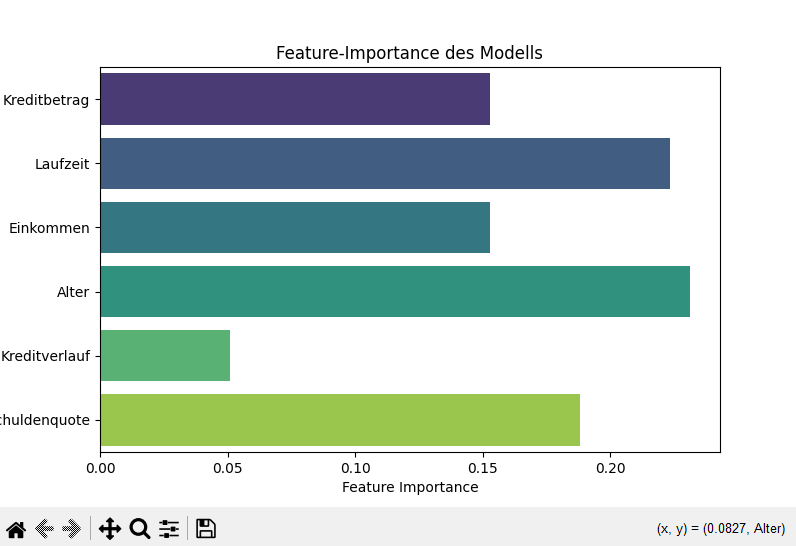
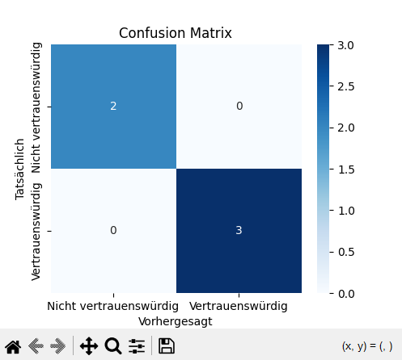
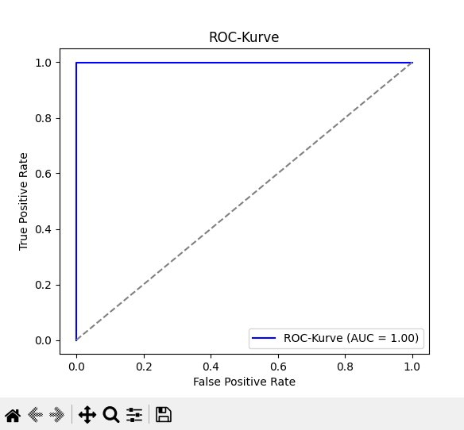

# 📚 Kreditrisiko-Modell mit Machine Learning

## 🔍 Projektbeschreibung
Dieses Projekt implementiert ein Machine-Learning-Modell zur Bewertung der Kreditwürdigkeit von Kunden. Mit **Scikit-Learn** und **Streamlit** haben wir ein Vorhersagemodell entwickelt, das verschiedene finanzielle Faktoren berücksichtigt, um die Wahrscheinlichkeit eines Kreditausfalls zu berechnen.

## 🔧 Features
- ✅ **ML-Modell zur Kreditrisikobewertung** (RandomForest)
- ✅ **Streamlit Web-App zur interaktiven Bewertung**
- ✅ **Feature-Importance-Analyse zur Modellinterpretation**
- ✅ **Performance-Metriken: Genauigkeit, Präzision, Recall, ROC-AUC**
- ✅ **Skalierung der Features mit StandardScaler**

## 🔄 Daten & Features
**Datensatz:** `kreditrisiko.csv` (synthetische Kreditdaten)

**Genutzte Features:**
- `Kreditbetrag` (Höhe des Kredits)
- `Laufzeit` (Monate)
- `Einkommen` (Jahreseinkommen)
- `Alter` (in Jahren)
- `Kreditverlauf` (Anzahl vorheriger Kredite)
- `Schuldenquote` (Verhältnis Schulden zu Einkommen)

**Target:** `Kreditwürdigkeit` (0 = schlecht, 1 = gut)

## 🔎 Technologie-Stack
- **Programmiersprache:** Python (3.9+)
- **Machine Learning:** Scikit-Learn, Pandas, NumPy
- **Web-App:** Streamlit
- **Visualisierung:** Matplotlib, Seaborn

## 🔄 Projektstruktur
```
kreditrisiko-modell/
├── data/
│   ├── kreditrisiko.csv  # Originaldatensatz
│   ├── kreditrisiko.db   # SQLite-Datenbank (optional)
├── notebooks/
│   ├── src/
│   │   ├── train_model.py        # Modelltraining
│   │   ├── evaluate_model.py     # Modellbewertung
│   │   ├── preprocessing.py      # Datenaufbereitung
│   │   ├── webapp/
│   │   │   ├── streamlit_app.py  # Web-App
│   │   │   ├── best_model.pkl    # Trainiertes Modell
│   │   │   ├── scaler.pkl        # Normalisierungs-Scaler
├── tests/                         # Unit-Tests (optional)
├── requirements.txt                # Abhängigkeiten
├── README.md                       # Projektbeschreibung
```

## 🛠️ Installation & Ausführung
### 1️⃣ **Repository klonen & in das Projektverzeichnis wechseln**
```bash
git clone https://github.com/ClashKong/kreditrisiko-modell.git
cd kreditrisiko-modell
```
### 2️⃣ **Virtuelle Umgebung einrichten & Abhängigkeiten installieren**
```bash
python -m venv venv
source venv/bin/activate  # macOS/Linux
venv\Scripts\activate    # Windows
pip install -r requirements.txt
```
### 3️⃣ **Modell trainieren & evaluieren**
```bash
python data/notebooks/src/train_model.py
python data/notebooks/src/evaluate_model.py
```
### 4️⃣ **Streamlit Web-App starten**
```bash
streamlit run data/notebooks/src/webapp/streamlit_app.py
```
Die Web-App öffnet sich unter [http://localhost:8501](http://localhost:8501)

## 📊 Ergebnisse
### Feature-Importance des Modells:



### Modell-Performance:
| Metrik       | Wert  |
|-------------|------|
| Genauigkeit | 1.00 |
| Präzision   | 1.00 |
| Recall      | 1.00 |
| F1-Score    | 1.00 |
| ROC-AUC     | 1.00 |

## 📚 Fazit
Dieses Projekt zeigt, wie **Machine Learning zur Kreditbewertung** eingesetzt werden kann. Arbeitgeber können sich hier einen Einblick in meine Fähigkeiten in **Datenanalyse, Modelltraining & Web-Entwicklung** verschaffen.

## 📲 Kontakt
Falls du Fragen hast oder mit mir über FinTech-Jobs in San Francisco sprechen möchtest, kontaktiere mich auf **LinkedIn** oder per **E-Mail**.

---
**🌟 Star das Repo, wenn es dir gefällt!** ⭐

